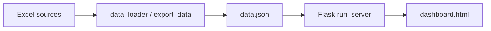
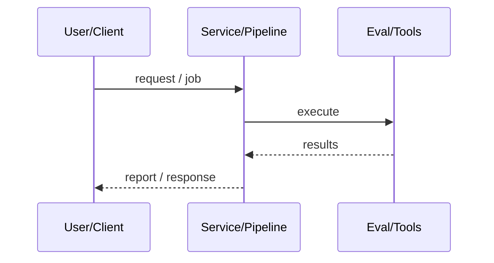
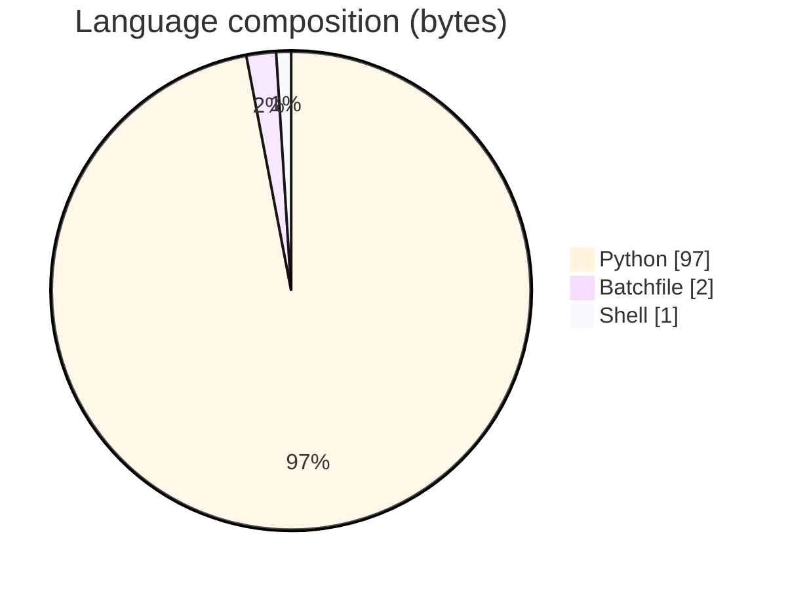

# Weelocal Economic Engine Dashboard

### Flask + static HTML analytics dashboard serving a 16-section KPI JSON for the Weelocal marketplace thesis.

[](https://github.com/ArchanaChetan07/Dashboard)
[](https://github.com/ArchanaChetan07/Dashboard)
[](https://github.com/ArchanaChetan07/Dashboard)
[](https://github.com/ArchanaChetan07/Dashboard/actions)

---

## Overview

Stakeholders need a single local web view of marketplace KPIs, sanitation/data-health reports, and geographic revenue breakdowns without a heavy BI stack.

Flask server (`Aditya Dashboard/run_server.py`) exposing `/`, `/data.json`, `/ping`; metrics/insights Python modules; precomputed `data.json`; documentation set (COMPLETION_REPORT, START_HERE).

Operational local dashboard with verified 3 HTTP endpoints and 16 required JSON sections documented in COMPLETION_REPORT.

This repository is maintained as **production-minded portfolio work**: clear architecture, automated checks where present, and metrics that are **traceable to committed artifacts** (never invented).

---

## Architecture

Excel/loaders → metrics/insights → data.json → Flask → dashboard.html





---

## Results & repository facts

> Only values found in code, configs, tests, or generated reports are listed. Absence of a clinical/ML accuracy number means it was **not** published in-repo.

| Metric | Value | Source |
|---|---|---|
| HTTP endpoints verified | **3 (/ping, /data.json, /)** | `Aditya Dashboard/COMPLETION_REPORT.md` |
| Top-level data.json sections | **16** | `Aditya Dashboard/COMPLETION_REPORT.md` |
| Reported data.json size | **438,643 bytes** | `Aditya Dashboard/COMPLETION_REPORT.md` |
| Reported dashboard.html size | **144,531 bytes** | `Aditya Dashboard/COMPLETION_REPORT.md` |
| Tracked files | **29** | `git tree` |
| Python modules | **9** | `git tree` |
| Test-related paths | **1** | `git tree` |
| CI workflows | **Yes** | `.github/workflows` |
| Docker present | **No** | `repo root` |



---

## Key features

- KPI, revenue trend, geo, Pareto, projections, valuation sections
- Data health + sanitation report panels
- Automated insights module
- Batch/shell launchers
- COMPLETION_REPORT verification checklist

---

## Tech stack

| Layer | Technology |
|---|---|
| language | Python |
| web | Flask |
| frontend | dashboard.html |
| data | data.json + Excel workbooks |
| analytics | metrics.py / insights.py |

---

## Skills demonstrated

Python · Flask · HTML/JS dashboard · pandas · CI/CD · testing · automation

Keyword surface: **Python · Python · machine-learning · CI/CD · testing · API · Docker · automation · data-science · software-engineering · system-design · observability · LLM · cloud**

---

## Project structure

```text
Dashboard/
├── Aditya Dashboard/
│   ├── run_server.py
│   ├── dashboard.html
│   ├── data.json
│   ├── metrics.py
│   └── COMPLETION_REPORT.md
├── requirements.txt
└── tests/
```

---

## Installation & usage

```bash
git clone https://github.com/ArchanaChetan07/Dashboard.git
cd "Dashboard/Aditya Dashboard"
pip install -r requirements.txt
python run_server.py
```

---

## How it works

Precomputed marketplace metrics are written to `data.json`; Flask serves the static dashboard and JSON API so charts render without live DB connections.

---

## Future improvements

- Replace absolute/local assumptions with configurable data paths
- Rewrite root README (currently template-spam)
- Add auth if deploying beyond localhost

---

## License

See repository.

---

<p align="center">
  <b>Weelocal Economic Engine Dashboard</b><br/>
  <a href="https://github.com/ArchanaChetan07/Dashboard">github.com/ArchanaChetan07/Dashboard</a>
</p>
